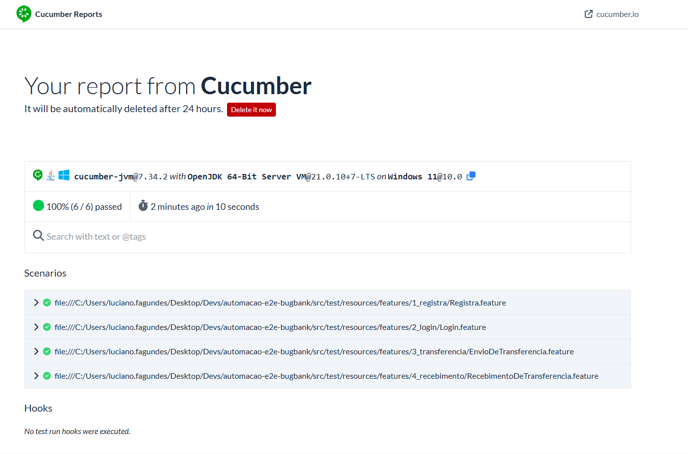

# 📌 Automação E2E - BugBank

##  Descrição do Projeto

Projeto de automação de testes end-to-end para aplicações web utilizando:

-    **Java 21**

-    **Maven**

-    **Selenium WebDriver**

-    **Selenium Grid (Docker)**

-    **Cucumber (BDD)**

-    **Cucumber Reports Online**

-    **CI/CD com Jenkins**

-    **Docker & Docker Compose**


*O objetivo é garantir qualidade, escalabilidade e execução automatizada em ambiente local e em pipeline CI.*

### Como configurar o ambiente❓

📌 [**README: Infraestrutura - Automação BugBank**](README-INFRA.md)

----------

# 🏗️ Arquitetura

## 🔹 Execução Local

-   Selenium Grid rodando via Docker Compose

-   Porta customizada (ex: 4445:4444)

-   Execução via Maven


## 🔹 Execução CI (Jenkins)

-   Jenkins rodando via Docker

-   Selenium Grid sobe dinamicamente via pipeline

-   Execução dentro de container Maven

-   Grid sobe na porta padrão 4444

-   Containers são finalizados após execução
----------

# ⚙️ Configuração do Ambiente

### 🔹 Requisitos

-   Docker

-   Docker Compose

-   Java 21 (para rodar local sem container)

-   Maven (opcional se usar container)


----------

# 🧩 Selenium Grid (Execução Local)

Subir Grid:
```bash
docker-compose up -d
```
Acessar UI:
```
http://localhost:4445/ui/
```
Parar Grid:
```bash
docker-compose down
```
----------

# 🧪 Executar Testes Localmente

### Executar por Runner:
```bash
mvn -Dtest=WebRunnerTest test
```

### Executar por Tag:
```bash
mvn test -Dcucumber.filter.tags="@Regressivo"
```
----------

# 🚀 Jenkins

### Subir Jenkins

```bash
docker start jenkins
```
Parar Jenkins:
```bash
docker stop jenkins
```
Acessar: 
```
http://localhost:8080
```
----------

# 🏗️ Pipeline

A pipeline realiza:

1.  Checkout do repositório

2.  Sobe Selenium Grid

3.  Executa testes via container Maven

4.  Finaliza containers do Grid


Parâmetros disponíveis:

-   `BROWSER` → chrome | firefox | edge

-   `HEADLESS` → true | false

-   `CUCUMBER_TAGS` → ex: @Regressivo

---

# 🌐 Configuração do GRID_URL

O projeto suporta dois modos de execução:

### 🖥️ LOCAL (Navegador Windows)

Quando rodando localmente:
```
GRID_URL=http://localhost:4445/wd/hub
```
Esse endereço conecta ao Selenium Grid rodando via docker-compose local.

---

### ⛅️ JENKINS (Executando dentro de Container)

Quando executado via Jenkins (container Docker):

```
OUTSIDE_NETWORK=http://host.docker.internal:4444/wd/hub
```
**Explicação:**

- localhost dentro do container NÃO aponta para sua máquina
- host.docker.internal permite que o container acesse o Docker host

---

# 🔁 Como o DriverFactory resolve isso

O `DriverFactory` usa:
```java
private static final String GRID_URL =
System.getProperty("grid.url", ConfigReader.get(value));
```

Ordem de prioridade:

- Usar o valor do `setuprun.properties` na seção `GRID_URL REMOTO DO SELENIUM GRID`

Isso permite flexibilidade para rodar local ou via CI.

---

# 📊 Relatórios

Relatórios publicados automaticamente no:

https://reports.cucumber.io

Disponíveis por 24h após execução.

### Evidência

